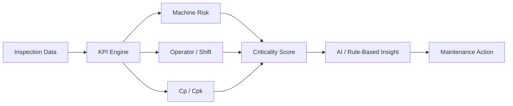

[README (4).md](https://github.com/user-attachments/files/28236090/README.4.md)
<p align="center">
  
</p>

<p align="center">
  <b>Production Quality Intelligence & Maintenance Decision Support</b>
</p>

<p align="center">
  
  
  
  
  
  
</p>

---

## About

**LineSight** is a Python desktop application for production quality analysis and maintenance decision support.

It reads inspection data, calculates quality and operational KPIs, scores risky machines, evaluates process capability with **Cp/Cpk**, compares operator/shift performance, and turns it all into AI-supported maintenance recommendations.

> Not just *seeing* the production line — knowing **which machine, shift, or process needs attention first, and why.**



---

## Features

| Module | What it does |
|:---|:---|
| **Dashboard** | Pass rate, failure rate, cost, downtime overview |
| **Machine Analysis** | Failure rate, cost, downtime, Cp/Cpk → criticality score |
| **Operator / Shift** | Performance comparison, worst shift/operator detection |
| **Process Capability** | Cp, Cpk and a capability verdict |
| **AI Analysis** | Decision-focused maintenance recommendations |
| **Report Export** | Self-contained HTML executive report |

---

## Machine Criticality Score

LineSight ranks machines by more than just failure count:

```
Criticality = Failure Rate + Failure Cost + Downtime + Cp/Cpk Penalty
```

The top priority isn't always the machine that fails most — sometimes it's the one that costs the most, stops the longest, or has the weakest process capability.

---

## Process Capability (Cp / Cpk)

```
Cp  = (USL - LSL) / (6σ)
Cpk = min[ (USL - μ) / (3σ), (μ - LSL) / (3σ) ]
```

| Cpk | Verdict |
|:---:|:---|
| ≥ 1.33 | Capable — stable and within spec |
| 1.00 – 1.33 | Marginal — acceptable but risky |
| < 1.00 | Not capable — needs re-centering |

---

## Dataset

Minimum required: `Machine_ID`, `Measurement`. Full analysis uses:

```
Machine_ID · Operator_ID · Shift · Product_Type · Measurement
LSL · USL · Status · Failure_Type · Failure_Cost · Downtime_Minutes
```

Missing optional columns are filled with safe defaults where possible.

---

## Installation

```bash
git clone https://github.com/HuseyincanErgin/LineSight.git
cd LineSight
pip install customtkinter pandas numpy matplotlib requests openpyxl
python LineSight_app.py
```

**Demo login:** `admin` / `admin`

**Gemini (optional):** set a key before running, otherwise the built-in rule-based engine is used.

```bash
set GEMINI_API_KEY=your_api_key_here
```

---

## Tech Stack

Python · CustomTkinter · pandas · NumPy · Matplotlib · Requests · OpenPyXL · Google Gemini API (optional)

---

## Developer

**Hüseyincan Ergin** — Industrial Engineering Student @ Marmara University

[](https://www.linkedin.com/in/hüseyincan-ergin)
[](https://github.com/HuseyincanErgin)
[](mailto:huseyincanergin@gmail.com)
