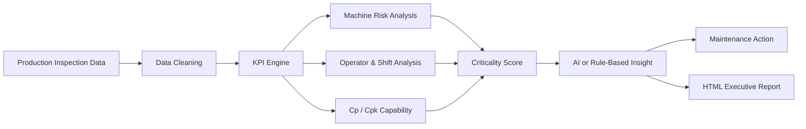
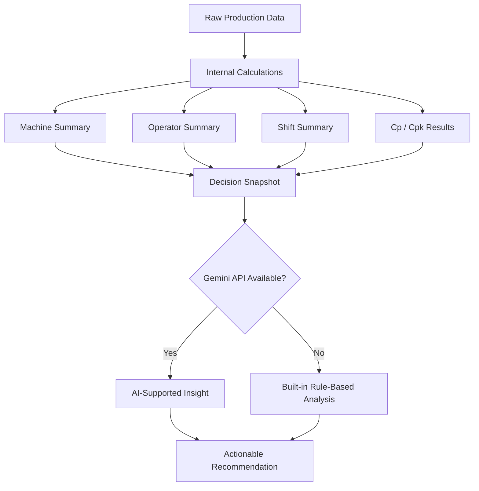

<p align="center">
  
</p>

## Production Quality Intelligence & Maintenance Decision Support

<p>
  <b>LineSight</b> is a Python desktop decision-support system that transforms production inspection data into
  <b>machine risk scores</b>, <b>Cp/Cpk capability insights</b>,
  <b>operator-shift performance signals</b>, and
  <b>AI-supported maintenance actions</b>.
</p>

<br/>


<br/><br/>


-2563eb?style=flat-square)


<br/><br/>

[](https://git.io/typing-svg)

<br/>

```text
╔══════════════════════════════════════════════════════════════════════════════╗
║                                 LineSight                                   ║
║          Production Quality • Machine Risk • AI Maintenance Insight          ║
╠══════════════════════════════════════════════════════════════════════════════╣
║                                                                              ║
║   🏭  Production Line Data                                                   ║
║          │                                                                   ║
║          ▼                                                                   ║
║   📊  KPI Engine  →  ⚙️  Risk Scoring  →  📏  Cp/Cpk  →  🧠  AI Insight       ║
║          │                                                                   ║
║          ▼                                                                   ║
║   📄  Executive Report + Maintenance Recommendation                          ║
║                                                                              ║
╚══════════════════════════════════════════════════════════════════════════════╝
```

### **See the line. Understand the risk. Improve the process.**

</div>

---

## 1. About the Project

**LineSight** is a Python-based desktop application designed for production quality analysis and maintenance decision support.

The application reads production inspection data, calculates quality and operational KPIs, identifies risky machines, evaluates process capability with **Cp/Cpk**, compares operator and shift performance, and generates AI-supported maintenance recommendations.

Instead of only showing raw tables, LineSight turns production data into a structured decision story:

> **Which machine, shift, or process area needs attention first — and why?**

---

## 2. Project Purpose

In production environments, quality problems are rarely explained by only one metric.

A machine may have a high failure rate.  
Another machine may fail less often but create higher cost.  
A shift may look normal overall but hide a risky operator-machine pattern.  
A process may still produce passing parts while its **Cpk** quietly shows instability.

LineSight combines these signals into one practical decision-support flow.

<div align="center">



</div>

---

## 3. Core Decision Logic

LineSight is built around converting production signals into action.

<div align="center">

| Input Signal | Analysis Layer | Decision Output |
|:---|:---|:---|
| Machine measurements | Cp / Cpk calculation | Process capability status |
| Pass / Fail results | Failure rate analysis | Quality performance signal |
| Failure cost | Cost impact analysis | Financial risk priority |
| Downtime minutes | Maintenance impact analysis | Operational loss indicator |
| Operator and shift data | Group comparison | Human/process pattern detection |
| Machine-level summaries | Criticality scoring | Maintenance priority ranking |
| Aggregated statistics | Gemini AI or rule engine | Actionable recommendation |

</div>

---

## 4. Key Features

<div align="center">

| Module | Purpose | Output |
|:---|:---|:---|
| **Executive Dashboard** | Gives a fast overview of production health | Total inspections, pass rate, failure rate, cost, downtime |
| **Machine Analysis** | Detects risky machines | Failure rate, failure cost, downtime, Cp/Cpk, criticality score |
| **Operator / Shift Analysis** | Compares performance patterns | Worst shift, worst operator, shift-operator combinations |
| **Process Capability** | Evaluates production stability | Cp, Cpk, capability verdict |
| **AI Analysis** | Produces decision-focused recommendations | Maintenance and quality action suggestions |
| **Raw Data View** | Shows uploaded or demo data | Clean tabular inspection dataset |
| **Report Export** | Creates an external report | Self-contained HTML executive report |

</div>

---

## 5. Application Pages

<div align="center">

| Page | Description |
|:---|:---|
| **Dashboard** | Overall KPI cards and general production quality summary |
| **Machine Analysis** | Machine-level performance, failure rates, costs, downtime, and criticality scores |
| **Operator / Shift** | Operator and shift performance comparison |
| **Process Capability** | Cp/Cpk values, capability interpretation, and process behavior |
| **AI Analysis** | AI-supported questions, insights, and maintenance recommendations |
| **Raw Data** | Uploaded or demo-generated production data |

</div>

---

## 6. What LineSight Calculates

LineSight automatically calculates several production quality and maintenance metrics.

```text
Total Inspections
Pass Count
Fail Count
Pass Rate
Failure Rate
Total Failure Cost
Total Downtime
Average Measurement
Cp
Cpk
Cost per 1000 Units
Machine Criticality Score
```

The goal is not only to display what happened, but to help decide what should be done next.

---

## 7. Machine Criticality Score

LineSight does not simply sort machines by failure count.

It creates a broader **machine criticality score** using multiple dimensions:

```text
Machine Criticality Score
        =
Failure Rate Impact
        +
Failure Cost Impact
        +
Downtime Impact
        +
Cp/Cpk Capability Penalty
```

This matters because the most important machine is not always the one with the highest number of failures.

Sometimes the real priority is the machine that creates the highest cost, longest downtime, or weakest process capability.

---

## 8. Process Capability Analysis

LineSight uses **Cp** and **Cpk** to evaluate whether the production process is capable and centered.

```text
Cp = (USL - LSL) / (6σ)
```

```text
Cpk = min(
        (USL - μ) / (3σ),
        (μ - LSL) / (3σ)
      )
```

<div align="center">

| Cpk Range | Interpretation | Meaning |
|:---:|:---|:---|
| **Cpk ≥ 1.33** | Capable | Process is generally stable and within specification |
| **1.00 ≤ Cpk < 1.33** | Marginal | Process is acceptable but risky |
| **Cpk < 1.00** | Not Capable | Process needs improvement or re-centering |

</div>

**Cp** shows whether the process spread can theoretically fit within the specification limits.  
**Cpk** shows whether the process is actually centered enough to perform well.

---

## 9. AI-Supported Insight System

LineSight uses AI carefully.

The application first calculates reliable production statistics internally. Then, if a Gemini API key is provided, AI is used as an explanation layer to turn those statistics into clear recommendations.

<div align="center">



</div>

> [!IMPORTANT]
> Gemini AI is optional.  
> If no API key is provided, LineSight still works with its built-in rule-based decision engine.

---

## 10. Expected Dataset

LineSight requires at least these columns:

```text
Machine_ID
Measurement
```

For a more complete analysis, the recommended dataset structure is:

```text
Machine_ID
Operator_ID
Shift
Product_Type
Measurement
LSL
USL
Status
Failure_Type
Failure_Cost
Downtime_Minutes
```

<div align="center">

| Column | Description |
|:---|:---|
| `Machine_ID` | Machine identifier |
| `Operator_ID` | Operator identifier |
| `Shift` | Production shift |
| `Product_Type` | Product category |
| `Measurement` | Quality measurement value |
| `LSL` | Lower Specification Limit |
| `USL` | Upper Specification Limit |
| `Status` | Pass or Fail result |
| `Failure_Type` | Defect or failure category |
| `Failure_Cost` | Cost caused by failed units |
| `Downtime_Minutes` | Downtime caused by failures |

</div>

If optional columns are missing, LineSight tries to fill safe default values where possible.

---

## 11. Tech Stack

<div align="center">

| Technology | Role in the Project |
|:---|:---|
| **Python** | Main programming language |
| **CustomTkinter** | Desktop application interface |
| **pandas** | Data cleaning, grouping, KPI calculation |
| **NumPy** | Numerical operations and demo data generation |
| **Matplotlib** | Embedded charts and visual analysis |
| **Requests** | Gemini API communication |
| **OpenPyXL** | Excel file support |
| **Google Gemini API** | Optional AI-supported insight generation |

</div>

---

## 12. Installation

```bash
# Clone the repository
git clone https://github.com/HuseyincanErgin/LineSight.git

# Go to the project folder
cd LineSight

# Install required libraries
pip install customtkinter pandas numpy matplotlib requests openpyxl

# Run the application
python LineSight_app.py
```

---

## 13. Demo Login

LineSight includes a simple demo login screen.

```text
Username: admin
Password: admin
```

---

## 14. Gemini API Key Setup

Gemini AI usage is optional.

For security, do not upload your real API key to GitHub.

Recommended usage:

```bash
set GEMINI_API_KEY=your_api_key_here
```

Then run:

```bash
python LineSight_app.py
```

If no API key is provided, the application continues with its built-in rule-based analysis system.

---

## 15. Project Structure

```text
LineSight/
│
├── LineSight_app.py
│   └── Main desktop application
│
├── README.md
│   └── Project documentation
│
└── requirements.txt
    └── Dependency list
```

Suggested `requirements.txt`:

```text
customtkinter
pandas
numpy
matplotlib
requests
openpyxl
```

---

## 16. Application Flow

```text
1. Login to the application
2. Use demo data or upload CSV / Excel data
3. Review dashboard KPIs
4. Analyze machine-level risk
5. Compare operators and shifts
6. Evaluate Cp / Cpk process capability
7. Generate AI-supported insights
8. Export the final HTML report
```

---

## 17. Example Decision Output

LineSight is designed to produce recommendations like:

```text
Machine M03 has the highest criticality score because it combines
a high failure rate, significant failure cost, downtime impact,
and weak Cpk performance.

Recommended first action:
Check calibration, inspect tool condition, review setup parameters,
and monitor the next batches with tighter SPC control.
```

This makes the project more than a dashboard.

It works like a small production analyst that turns quality data into maintenance priorities.

---

## 18. Use Cases

LineSight can be used for:

- Production quality monitoring
- Machine failure analysis
- Maintenance prioritization
- Cp/Cpk process capability evaluation
- Operator and shift performance comparison
- Industrial engineering analytics projects
- Quality dashboard demonstrations
- AI-supported decision-support prototypes
- Manufacturing data storytelling

---

## 19. Why LineSight?

<div align="center">

```text
LineSight is built for one core purpose:

Not just seeing the production line.
Understanding where the line is losing quality, time, and money.
```

</div>

LineSight combines quality control, maintenance analytics, process capability, and AI-supported interpretation in a single desktop application.

It is designed as a practical industrial engineering project that connects data analysis with real production decision-making.

---

## 20. Project Tags

<div align="center">


</div>

---

## 21. Developer

<div align="center">

**Hüseyincan Ergin**  
Industrial Engineering Student @ Marmara University

<br/>

[](https://www.linkedin.com/in/hüseyincan-ergin)
[](https://github.com/HuseyincanErgin)
[](mailto:huseyincanergin@gmail.com)

</div>

---

<div align="center">

### Built with Python, production data, and a little bit of manufacturing paranoia.

</div>

## Production Quality Intelligence & Maintenance Decision Support

<p>
  <b>LineSight</b> is a Python desktop decision-support system that transforms production inspection data into
  <b>machine risk scores</b>, <b>Cp/Cpk capability insights</b>,
  <b>operator-shift performance signals</b>, and
  <b>AI-supported maintenance actions</b>.
</p>

<br/>


<br/><br/>


-2563eb?style=flat-square)


<br/><br/>

[](https://git.io/typing-svg)

<br/>

```text
╔══════════════════════════════════════════════════════════════════════════════╗
║                                 LineSight                                   ║
║          Production Quality • Machine Risk • AI Maintenance Insight          ║
╠══════════════════════════════════════════════════════════════════════════════╣
║                                                                              ║
║   🏭  Production Line Data                                                   ║
║          │                                                                   ║
║          ▼                                                                   ║
║   📊  KPI Engine  →  ⚙️  Risk Scoring  →  📏  Cp/Cpk  →  🧠  AI Insight       ║
║          │                                                                   ║
║          ▼                                                                   ║
║   📄  Executive Report + Maintenance Recommendation                          ║
║                                                                              ║
╚══════════════════════════════════════════════════════════════════════════════╝
```

### **See the line. Understand the risk. Improve the process.**

</div>

---

## 1. About the Project

**LineSight** is a Python-based desktop application designed for production quality analysis and maintenance decision support.

The application reads production inspection data, calculates quality and operational KPIs, identifies risky machines, evaluates process capability with **Cp/Cpk**, compares operator and shift performance, and generates AI-supported maintenance recommendations.

Instead of only showing raw tables, LineSight turns production data into a structured decision story:

> **Which machine, shift, or process area needs attention first — and why?**

---

## 2. Project Purpose

In production environments, quality problems are rarely explained by only one metric.

A machine may have a high failure rate.  
Another machine may fail less often but create higher cost.  
A shift may look normal overall but hide a risky operator-machine pattern.  
A process may still produce passing parts while its **Cpk** quietly shows instability.

LineSight combines these signals into one practical decision-support flow.

<div align="center">


</div>

---

## 3. Core Decision Logic

LineSight is built around converting production signals into action.

<div align="center">

| Input Signal | Analysis Layer | Decision Output |
|:---|:---|:---|
| Machine measurements | Cp / Cpk calculation | Process capability status |
| Pass / Fail results | Failure rate analysis | Quality performance signal |
| Failure cost | Cost impact analysis | Financial risk priority |
| Downtime minutes | Maintenance impact analysis | Operational loss indicator |
| Operator and shift data | Group comparison | Human/process pattern detection |
| Machine-level summaries | Criticality scoring | Maintenance priority ranking |
| Aggregated statistics | Gemini AI or rule engine | Actionable recommendation |

</div>

---

## 4. Key Features

<div align="center">

| Module | Purpose | Output |
|:---|:---|:---|
| **Executive Dashboard** | Gives a fast overview of production health | Total inspections, pass rate, failure rate, cost, downtime |
| **Machine Analysis** | Detects risky machines | Failure rate, failure cost, downtime, Cp/Cpk, criticality score |
| **Operator / Shift Analysis** | Compares performance patterns | Worst shift, worst operator, shift-operator combinations |
| **Process Capability** | Evaluates production stability | Cp, Cpk, capability verdict |
| **AI Analysis** | Produces decision-focused recommendations | Maintenance and quality action suggestions |
| **Raw Data View** | Shows uploaded or demo data | Clean tabular inspection dataset |
| **Report Export** | Creates an external report | Self-contained HTML executive report |

</div>

---

## 5. Application Pages

<div align="center">

| Page | Description |
|:---|:---|
| **Dashboard** | Overall KPI cards and general production quality summary |
| **Machine Analysis** | Machine-level performance, failure rates, costs, downtime, and criticality scores |
| **Operator / Shift** | Operator and shift performance comparison |
| **Process Capability** | Cp/Cpk values, capability interpretation, and process behavior |
| **AI Analysis** | AI-supported questions, insights, and maintenance recommendations |
| **Raw Data** | Uploaded or demo-generated production data |

</div>

---

## 6. What LineSight Calculates

LineSight automatically calculates several production quality and maintenance metrics.

```text
Total Inspections
Pass Count
Fail Count
Pass Rate
Failure Rate
Total Failure Cost
Total Downtime
Average Measurement
Cp
Cpk
Cost per 1000 Units
Machine Criticality Score
```

The goal is not only to display what happened, but to help decide what should be done next.

---

## 7. Machine Criticality Score

LineSight does not simply sort machines by failure count.

It creates a broader **machine criticality score** using multiple dimensions:

```text
Machine Criticality Score
        =
Failure Rate Impact
        +
Failure Cost Impact
        +
Downtime Impact
        +
Cp/Cpk Capability Penalty
```

This matters because the most important machine is not always the one with the highest number of failures.

Sometimes the real priority is the machine that creates the highest cost, longest downtime, or weakest process capability.

---

## 8. Process Capability Analysis

LineSight uses **Cp** and **Cpk** to evaluate whether the production process is capable and centered.

```text
Cp = (USL - LSL) / (6σ)
```

```text
Cpk = min(
        (USL - μ) / (3σ),
        (μ - LSL) / (3σ)
      )
```

<div align="center">

| Cpk Range | Interpretation | Meaning |
|:---:|:---|:---|
| **Cpk ≥ 1.33** | Capable | Process is generally stable and within specification |
| **1.00 ≤ Cpk < 1.33** | Marginal | Process is acceptable but risky |
| **Cpk < 1.00** | Not Capable | Process needs improvement or re-centering |

</div>

**Cp** shows whether the process spread can theoretically fit within the specification limits.  
**Cpk** shows whether the process is actually centered enough to perform well.

---

## 9. AI-Supported Insight System

LineSight uses AI carefully.

The application first calculates reliable production statistics internally. Then, if a Gemini API key is provided, AI is used as an explanation layer to turn those statistics into clear recommendations.

<div align="center">


</div>

> [!IMPORTANT]
> Gemini AI is optional.  
> If no API key is provided, LineSight still works with its built-in rule-based decision engine.

---

## 10. Expected Dataset

LineSight requires at least these columns:

```text
Machine_ID
Measurement
```

For a more complete analysis, the recommended dataset structure is:

```text
Machine_ID
Operator_ID
Shift
Product_Type
Measurement
LSL
USL
Status
Failure_Type
Failure_Cost
Downtime_Minutes
```

<div align="center">

| Column | Description |
|:---|:---|
| `Machine_ID` | Machine identifier |
| `Operator_ID` | Operator identifier |
| `Shift` | Production shift |
| `Product_Type` | Product category |
| `Measurement` | Quality measurement value |
| `LSL` | Lower Specification Limit |
| `USL` | Upper Specification Limit |
| `Status` | Pass or Fail result |
| `Failure_Type` | Defect or failure category |
| `Failure_Cost` | Cost caused by failed units |
| `Downtime_Minutes` | Downtime caused by failures |

</div>

If optional columns are missing, LineSight tries to fill safe default values where possible.

---

## 11. Tech Stack

<div align="center">

| Technology | Role in the Project |
|:---|:---|
| **Python** | Main programming language |
| **CustomTkinter** | Desktop application interface |
| **pandas** | Data cleaning, grouping, KPI calculation |
| **NumPy** | Numerical operations and demo data generation |
| **Matplotlib** | Embedded charts and visual analysis |
| **Requests** | Gemini API communication |
| **OpenPyXL** | Excel file support |
| **Google Gemini API** | Optional AI-supported insight generation |

</div>

---

## 12. Installation

```bash
# Clone the repository
git clone https://github.com/HuseyincanErgin/LineSight.git

# Go to the project folder
cd LineSight

# Install required libraries
pip install customtkinter pandas numpy matplotlib requests openpyxl

# Run the application
python LineSight_app.py
```

---

## 13. Demo Login

LineSight includes a simple demo login screen.

```text
Username: admin
Password: admin
```

---

## 14. Gemini API Key Setup

Gemini AI usage is optional.

For security, do not upload your real API key to GitHub.

Recommended usage:

```bash
set GEMINI_API_KEY=your_api_key_here
```

Then run:

```bash
python LineSight_app.py
```

If no API key is provided, the application continues with its built-in rule-based analysis system.

---

## 15. Project Structure

```text
LineSight/
│
├── LineSight_app.py
│   └── Main desktop application
│
├── README.md
│   └── Project documentation
│
└── requirements.txt
    └── Dependency list
```

Suggested `requirements.txt`:

```text
customtkinter
pandas
numpy
matplotlib
requests
openpyxl
```

---

## 16. Application Flow

```text
1. Login to the application
2. Use demo data or upload CSV / Excel data
3. Review dashboard KPIs
4. Analyze machine-level risk
5. Compare operators and shifts
6. Evaluate Cp / Cpk process capability
7. Generate AI-supported insights
8. Export the final HTML report
```

---

## 17. Example Decision Output

LineSight is designed to produce recommendations like:

```text
Machine M03 has the highest criticality score because it combines
a high failure rate, significant failure cost, downtime impact,
and weak Cpk performance.

Recommended first action:
Check calibration, inspect tool condition, review setup parameters,
and monitor the next batches with tighter SPC control.
```

This makes the project more than a dashboard.

It works like a small production analyst that turns quality data into maintenance priorities.

---

## 18. Use Cases

LineSight can be used for:

- Production quality monitoring
- Machine failure analysis
- Maintenance prioritization
- Cp/Cpk process capability evaluation
- Operator and shift performance comparison
- Industrial engineering analytics projects
- Quality dashboard demonstrations
- AI-supported decision-support prototypes
- Manufacturing data storytelling

---

## 19. Why LineSight?

<div align="center">

```text
LineSight is built for one core purpose:

Not just seeing the production line.
Understanding where the line is losing quality, time, and money.
```

</div>

LineSight combines quality control, maintenance analytics, process capability, and AI-supported interpretation in a single desktop application.

It is designed as a practical industrial engineering project that connects data analysis with real production decision-making.

---

## 20. Project Tags

<div align="center">


</div>

---

## 21. Developer

<div align="center">

**Hüseyincan Ergin**  
Industrial Engineering Student @ Marmara University

<br/>

[](https://www.linkedin.com/in/hüseyincan-ergin)
[](https://github.com/HuseyincanErgin)
[](mailto:huseyincanergin@gmail.com)

</div>

---

<div align="center">

### Built with Python, production data, and a little bit of manufacturing paranoia.

</div>
