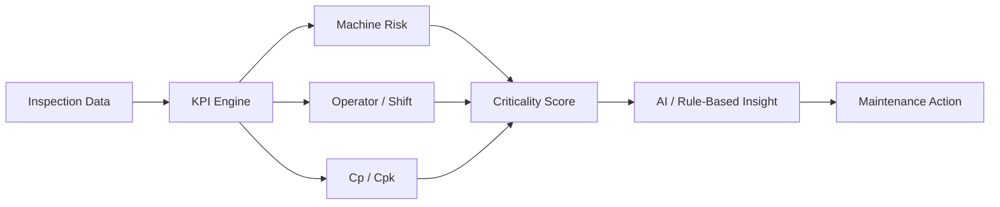

<p align="center">
  
</p>

<p align="center">
  <b>Production Quality Intelligence & Maintenance Decision Support</b>
</p>

<p align="center">
  
  
  
  
  
  
</p>

---

## About

**LineSight** is a Python desktop application for production quality analysis and maintenance decision support.

It reads inspection data, calculates quality and operational KPIs, scores risky machines, evaluates process capability with **Cp/Cpk**, compares operator/shift performance, and turns it all into AI-supported maintenance recommendations.

> Not just *seeing* the production line — knowing **which machine, shift, or process needs attention first, and why.**



---

## Features

| Module | What it does |
|:---|:---|
| **Dashboard** | Pass rate, failure rate, cost, downtime overview |
| **Machine Analysis** | Failure rate, cost, downtime, Cp/Cpk → criticality score |
| **Operator / Shift** | Performance comparison, worst shift/operator detection |
| **Process Capability** | Cp, Cpk and a capability verdict |
| **AI Analysis** | Decision-focused maintenance recommendations |
| **Raw Data** | Uploaded or demo-generated inspection data |
| **Report Export** | Self-contained HTML executive report |

---

## What LineSight Calculates

```
Total Inspections · Pass / Fail Count · Pass Rate · Failure Rate
Total Failure Cost · Total Downtime · Average Measurement
Cp · Cpk · Cost per 1000 Units · Machine Criticality Score
```

---

## Machine Criticality Score

LineSight ranks machines by more than just failure count:

```
Criticality = Failure Rate + Failure Cost + Downtime + Cp/Cpk Penalty
```

The top priority isn't always the machine that fails most — sometimes it's the one that costs the most, stops the longest, or has the weakest process capability.

---

## Process Capability (Cp / Cpk)

```
Cp  = (USL - LSL) / (6σ)
Cpk = min[ (USL - μ) / (3σ), (μ - LSL) / (3σ) ]
```

| Cpk | Verdict |
|:---:|:---|
| ≥ 1.33 | Capable — stable and within spec |
| 1.00 – 1.33 | Marginal — acceptable but risky |
| < 1.00 | Not capable — needs re-centering |

---

## Dataset

Minimum required: `Machine_ID`, `Measurement`. Full analysis uses:

```
Machine_ID · Operator_ID · Shift · Product_Type · Measurement
LSL · USL · Status · Failure_Type · Failure_Cost · Downtime_Minutes
```

Missing optional columns are filled with safe defaults where possible.

---

## Sample Dataset

A ready-to-use Excel sample dataset is included so users can test LineSight without preparing their own data first.

**Sample file:** `linesight_sample_dataset.xlsx`

This dataset was used while developing and testing the app. It contains **500 production inspection records** and is suitable for trying the dashboard, machine analysis, operator/shift comparison, process capability analysis, AI-supported insights, and report export features.

| Column Group | Included Columns |
|:---|:---|
| **Part & Batch Info** | `PartID`, `BatchNo`, `ProductionDate` |
| **Production Context** | `Shift`, `Operator`, `MachineID` |
| **Measurements** | `Length1(mm)`, `Length2(mm)`, `Width(mm)` |
| **Specification Limits** | `LSL`, `USL` |
| **Quality Result** | `PassFail`, `InspectionNotes` |
| **Operational Impact** | `CostPerUnit(USD)`, `Downtime(min)` |

Users can upload this sample Excel file into the app and explore how LineSight converts raw inspection data into KPIs, machine risk scores, Cp/Cpk results, and maintenance-focused recommendations.

---

## 🛠️ Teknoloji — Tech Stack

<p align="center">
  
</p>

<p align="center">
  
  
  
  
  
</p>

Bu projede yazılım dili olarak **Python** kullanılmıştır. Arayüz, veri işleme, KPI hesaplama, grafik üretimi, rapor oluşturma ve AI destekli analiz akışı Python ekosistemi üzerinde geliştirilmiştir. Projenin amacı ayrı bir web frontend/backend sistemi kurmak değil; üretim kalite verilerini analiz eden, desktop application mantığında çalışan Python tabanlı bir karar destek aracı geliştirmektir.

---

## Tech Stack

| Technology | Role |
|:---|:---|
| **Python** | Main language |
| **CustomTkinter** | Desktop interface |
| **pandas** | Data cleaning, grouping, KPI calculation |
| **NumPy** | Numerical ops + demo data generation |
| **Matplotlib** | Embedded charts |
| **Requests** | Gemini API communication |
| **OpenPyXL** | Excel file support |
| **Google Gemini API** | Optional AI-supported insight |

---

## Project Status

This repository currently presents the **LineSight** project concept, feature scope, technology stack, and analysis logic.

The Python desktop application source code will be added after the final file organization and testing process. Until then, this README focuses on explaining what the project does, which technologies are used, and how the system is designed.

| Repository Item | Description |
|:---|:---|
| **README.md** | Project explanation, features, formulas, tech stack and output logic |
| **linesight_banner.svg** | Visual banner used at the top of the repository |
| **linesight_sample_dataset.xlsx** | Sample Excel dataset that users can upload to test the analysis flow |
| **Python source code** | Will be added after final cleanup and testing |

---

## Suggested Next Additions

| Addition | Why it helps |
|:---|:---|
| **Screenshots** | Shows the interface before users run the app |
| **Sample Dataset** | Included as `linesight_sample_dataset.xlsx` so users can test the app with ready data |
| **requirements.txt** | Makes dependency installation easier later |
| **Source Code** | Allows others to run the desktop application locally |
| **LICENSE** | Clarifies how others can use the project |

---

## Example Output

```
Machine M03 has the highest criticality score — high failure rate,
significant cost, downtime impact, and weak Cpk.

Recommended action: check calibration, inspect tool condition,
review setup parameters, monitor next batches with tighter SPC.
```

It works less like a dashboard, more like a small production analyst turning quality data into maintenance priorities.

---

## Developer

**Hüseyincan Ergin** — Industrial Engineering Student @ Marmara University

[](https://www.linkedin.com/in/hüseyincan-ergin)
[](https://github.com/HuseyincanErgin)
[](mailto:huseyincanergin@gmail.com)
