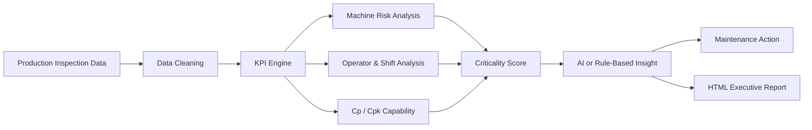
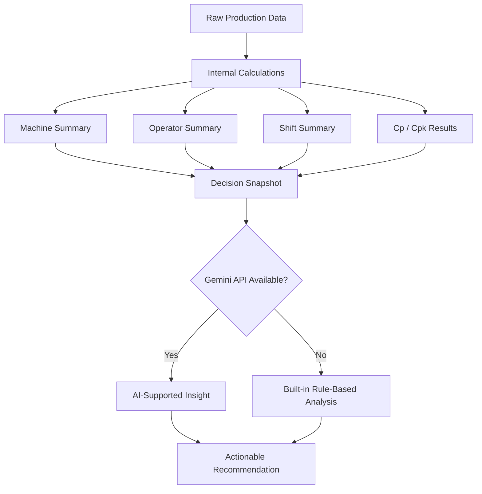

<div align="center">

# 🛰️ LineSight

### Production Quality Intelligence & Maintenance Decision Support

<p>
  A desktop decision-support system that transforms production inspection data into
  <b>machine risk scores</b>, <b>Cp/Cpk capability insights</b>,
  <b>operator-shift performance signals</b>, and
  <b>AI-supported maintenance actions</b>.
</p>

<br/>


<br/>


</div>

---

<div align="center">

```text
╔════════════════════════════════════════════════════════════════════╗
║                            LineSight                              ║
║         Production Quality • Machine Risk • AI Insights            ║
╠════════════════════════════════════════════════════════════════════╣
║  Data In      CSV / Excel inspection data                          ║
║  Core Engine  Quality KPIs + Cp/Cpk + criticality scoring           ║
║  Intelligence Machine, operator, shift, and process diagnostics     ║
║  AI Layer     Gemini-supported recommendations or rule-based logic  ║
║  Output       Executive-style HTML report                           ║
╚════════════════════════════════════════════════════════════════════╝
```

</div>

---

## 1. What is LineSight?

**LineSight** is a Python-based desktop application designed for production quality analysis and maintenance decision support.

It reads production inspection data and helps answer practical manufacturing questions such as:

> Which machine is creating the highest risk?  
> Which shift or operator group needs attention?  
> Is the process capable according to Cp/Cpk?  
> Which maintenance action should be prioritized first?

Instead of only displaying raw tables, LineSight turns production data into a structured decision story.

---

## 2. Why this project matters

In production environments, quality problems usually do not come from a single number.

A machine may have a high failure rate.  
Another one may create fewer failures but higher cost.  
A shift may look acceptable overall but contain a risky operator-machine combination.  
A process may still produce passing parts while its Cpk quietly shows instability.

LineSight combines these signals into one decision-support flow:

<div align="center">



</div>

---

## 3. Main dashboard logic

LineSight is built around a simple idea:

<div align="center">

| Input Signal | Analysis Layer | Decision Output |
|:---|:---|:---|
| Machine measurements | Cp / Cpk calculation | Process capability status |
| Pass / Fail results | Failure rate analysis | Quality performance signal |
| Failure cost | Cost impact analysis | Financial risk priority |
| Downtime minutes | Maintenance impact analysis | Operational loss indicator |
| Operator and shift data | Group comparison | Human/process pattern detection |
| Machine-level summaries | Criticality scoring | Maintenance priority ranking |
| Aggregated statistics | Gemini AI or rule engine | Actionable recommendation |

</div>

---

## 4. Features

<div align="center">

| Module | Purpose | Output |
|:---|:---|:---|
| **Executive Dashboard** | Gives a fast overview of production health | Total inspections, pass rate, failure rate, cost, downtime |
| **Machine Analysis** | Detects risky machines | Failure rate, failure cost, downtime, Cp/Cpk, criticality score |
| **Operator / Shift Analysis** | Compares performance patterns | Worst shift, worst operator, shift-operator combinations |
| **Process Capability** | Evaluates production stability | Cp, Cpk, capability verdict |
| **AI Analysis** | Produces decision-focused recommendations | Maintenance and quality action suggestions |
| **Raw Data View** | Shows uploaded or demo data | Clean tabular inspection dataset |
| **Report Export** | Creates an external report | Self-contained HTML executive report |

</div>

---

## 5. Decision engine

LineSight does not simply sort machines by failure count.

It creates a broader **machine criticality score** using multiple risk dimensions:

```text
Machine Criticality Score
        =
Failure Rate Impact
        +
Failure Cost Impact
        +
Downtime Impact
        +
Cp/Cpk Capability Penalty
```

This matters because the most important machine is not always the one with the most failures.

Sometimes the real priority is the machine that creates the highest financial loss, longest downtime, or weakest process capability.

---

## 6. Process capability analysis

LineSight uses Cp and Cpk to evaluate whether the production process is capable and centered.

```text
Cp = (USL - LSL) / (6σ)
```

```text
Cpk = min(
        (USL - μ) / (3σ),
        (μ - LSL) / (3σ)
      )
```

<div align="center">

| Cpk Range | Interpretation | Meaning |
|:---:|:---|:---|
| **Cpk ≥ 1.33** | Capable | Process is generally stable and within specification |
| **1.00 ≤ Cpk < 1.33** | Marginal | Process is acceptable but risky |
| **Cpk < 1.00** | Not Capable | Process needs improvement or re-centering |

</div>

Cp tells whether the process spread can theoretically fit within limits.  
Cpk tells whether the process is actually centered enough to perform well.

---

## 7. AI-supported insight system

LineSight uses AI carefully.

The application first calculates reliable production statistics internally.  
Then Gemini AI can be used as an explanation layer to turn those statistics into clear recommendations.

<div align="center">



</div>

> [!IMPORTANT]
> Gemini AI is optional.  
> If no API key is provided, LineSight still works with its built-in rule-based decision engine.

---

## 8. Application pages

<div align="center">

| Page | What you see |
|:---|:---|
| **Dashboard** | Overall KPI cards and general production quality summary |
| **Machine Analysis** | Machine-level performance, failure rates, costs, downtime, and criticality scores |
| **Operator / Shift** | Operator and shift performance comparison |
| **Process Capability** | Cp/Cpk values, capability interpretation, and process behavior |
| **AI Analysis** | AI-supported questions, insights, and maintenance recommendations |
| **Raw Data** | Uploaded or demo-generated production data |

</div>

---

## 9. Expected dataset

LineSight needs at least:

```text
Machine_ID
Measurement
```

For a complete analysis, the recommended dataset structure is:

```text
Machine_ID
Operator_ID
Shift
Product_Type
Measurement
LSL
USL
Status
Failure_Type
Failure_Cost
Downtime_Minutes
```

<div align="center">

| Column | Description |
|:---|:---|
| `Machine_ID` | Machine identifier |
| `Operator_ID` | Operator identifier |
| `Shift` | Production shift |
| `Product_Type` | Product category |
| `Measurement` | Quality measurement value |
| `LSL` | Lower Specification Limit |
| `USL` | Upper Specification Limit |
| `Status` | Pass or Fail result |
| `Failure_Type` | Defect or failure category |
| `Failure_Cost` | Cost caused by failed units |
| `Downtime_Minutes` | Downtime caused by failures |

</div>

If optional columns are missing, LineSight tries to fill safe default values where possible.

---

## 10. Tech stack

<div align="center">

| Technology | Role in the project |
|:---|:---|
| **Python** | Main programming language |
| **CustomTkinter** | Desktop application interface |
| **pandas** | Data cleaning, grouping, KPI calculation |
| **NumPy** | Numerical operations and demo data generation |
| **Matplotlib** | Embedded charts and visual analysis |
| **Requests** | Gemini API communication |
| **OpenPyXL** | Excel file support |
| **Google Gemini API** | Optional AI-supported insight generation |

</div>

---

## 11. How to run

```bash
# Clone the repository
git clone https://github.com/HuseyincanErgin/LineSight.git

# Go to the project folder
cd LineSight

# Install required libraries
pip install customtkinter pandas numpy matplotlib requests openpyxl

# Run the app
python LineSight_app.py
```

---

## 12. Demo login

LineSight includes a simple demo login screen.

```text
Username: admin
Password: admin
```

---

## 13. Gemini API key setup

Gemini AI is optional.

For security, do not upload your real API key to GitHub.

Recommended usage:

```bash
set GEMINI_API_KEY=your_api_key_here
```

Then run:

```bash
python LineSight_app.py
```

If no API key is provided, the app continues with rule-based analysis.

---

## 14. Project structure

```text
LineSight/
│
├── LineSight_app.py
│   └── Main desktop application
│
├── README.md
│   └── Project documentation
│
└── requirements.txt
    └── Dependency list
```

Suggested `requirements.txt`:

```text
customtkinter
pandas
numpy
matplotlib
requests
openpyxl
```

---

## 15. Example decision output

LineSight is designed to produce recommendations like:

```text
Machine M03 has the highest criticality score because it combines
a high failure rate, significant failure cost, downtime impact,
and weak Cpk performance.

Recommended first action:
Check calibration, inspect tool condition, review setup parameters,
and monitor the next batches with tighter SPC control.
```

This makes the project more than a dashboard.

It works like a small production analyst that turns quality data into maintenance priorities.

---

## 16. Project use cases

LineSight can be used for:

- Production quality monitoring
- Machine failure analysis
- Maintenance prioritization
- Cp/Cpk process capability evaluation
- Operator and shift performance comparison
- Industrial engineering analytics projects
- Quality dashboard demonstrations
- AI-supported decision-support prototypes
- Manufacturing data storytelling

---

## 17. Project identity

<div align="center">

```text
LineSight is built for one core purpose:

Not just seeing the line.
Understanding where the line is losing quality, time, and money.
```

</div>

---

## 18. Tags

<div align="center">


</div>

---

## 19. Developer

<div align="center">

**Hüseyincan Ergin**  
Industrial Engineering Student @ Marmara University

<br/>

[](https://www.linkedin.com/in/hüseyincan-ergin)
[](https://github.com/HuseyincanErgin)
[](mailto:huseyincanergin@gmail.com)

</div>

---

<div align="center">

### Built with Python, production data, and a little bit of manufacturing paranoia.

</div>
